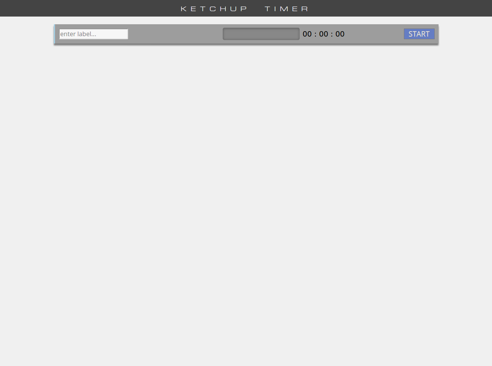

# Norman Hanson - Ketchup Timer Application

Synopsis: A simple to use task management application that's loosely based on the Pomodoro techinique.

## Table of contents

- [Overview](#overview)
  - [Motivation](#motivation)
  - [User story](#user-story)
  - [Screenshot](#screenshot)
  - [Links](#links)
- [My process](#my-process)
  - [Built with](#built-with)
  - [What I learned](#what-i-learned)
  - [Continued development](#continued-development)
  - [Useful resources](#useful-resources)
- [Author](#author)
- [Acknowledgments](#acknowledgments)

## Overview

### Motivation

### User story

As a User:

<<<<<<< HEAD
- I can set a timer that rings an alarm when an event's time has elapsed.
- I can customize the length of each event
- I can define a label for each event
=======
-
-
>>>>>>> 6e0dc8c6685c6dc54038138c749937c813ef0a25

### Screenshot



### Links

- Solution URL: [Ketchup Timer Application](ADD URL)
- Live Site URL: [Ketchup Timer Application](ADD URL)

## My process

### Built with

- Add technology #1
- Add technology #2
- Add technology #3

### What I learned

Working on this application helped me to improve in the following ways:

- What I learned #1
- What I learned #2
- What I learned #3

Example Code Sample

```css
a {
  color: red;
}
```

### Continued development

Some areas I would like to improve on in future projects:

- Area to improve #1
- Area to improve #2
- Area to improve #3

### Useful resources

- Useful resource #1
- Useful resource #2
- Useful resource #3
- This README file was heavly inspired by the one developed by the folks at [Frontend
  Mentor](https://www.frontendmentor.io).

## Author

- GitHub - [nmhanson339](https://nmhanson339.github.io)

## Acknowledgments

- Helper #1
- Helper #2
- Helper #3
